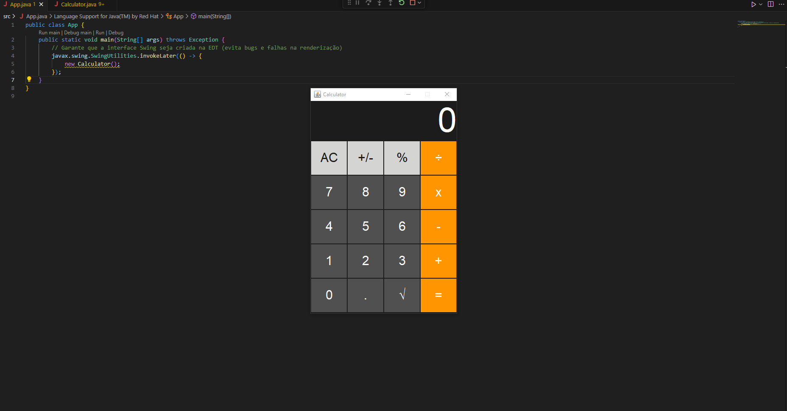

# Calculadora Java (Swing)

Projeto simples de uma calculadora feita em Java usando Swing.

## O que ela faz
- Operações básicas (+, -, x, ÷)
- Lida com números decimais
- Botão AC (limpar tudo)
- Função de inverter sinal (+/-)
- Tratamento de ponto decimal
- Remoção de zeros desnecessários no resultado (ex: 8.0 -> 8)

## Interface

